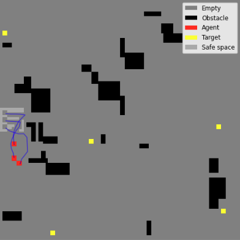

# PSO in the Wild: A Benchmarking Study of Target Search Algorithms

## Description

This project implements and benchmarks five target-search algorithms in a 2D grid environment with obstacles and visual feedback. The system simulates agents searching for targets using various strategies like Particle Swarm Optimization (PSO), exhaustive search, and more. 

## Features

- 2D simulation grid with customizable number of agents, targets, and obstacles.
- Five benchmarked search algorithms.
- Visualizations of the agent movements and discoveries.
- Modular codebase with clear separation of grid logic, agents, and algorithms.

## Algorithms Included

1. **Exhaustive Search** - Agents systematically cover the entire search area in a predefined pattern to locate targets.
2. **Random Search** - Agents move randomly throughout the grid, relying on chance to find targets.
3. **Distributed PSO (DPSO)** - Agents collaboratively optimize their search using particle swarm principles, sharing information across the group.
4. **Robotic Darwinian PSO (RDPSO)** - An evolutionary variant of PSO where agents adapt and evolve based on performance, mimicking natural selection.
5. **Exploration Enhanced PSO (E2RPSO)** - A PSO variant that emphasizes increased exploration to avoid local optima and improve target discovery.

## Visuals
Visualization frames are generated by `visualize_grid()` and saved in the output folder. Here's an example:

## Installation
The packages needed can be installed using the requirements.txt file. 

To install these requirements run: pip install -r requirements.txt

## Usage
To use this code you have to run the simulation in main.py

Doing this will:
- Set up the grid
- Initialize agents and targets
- Run all 5 algorithms sequentially
- Generate visualizations and summary statistics

Parameters can be customized inside main.py

## Authors and acknowledgment
Femke Aminetzah
Theun van den Broek
Sam de Vries

## License
Not licensed

